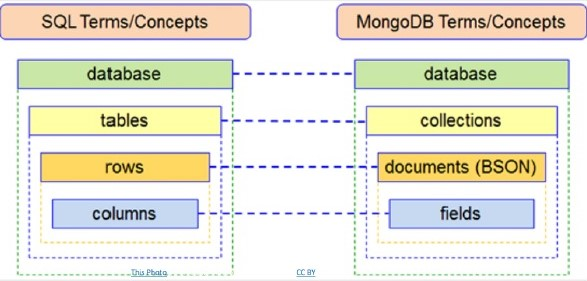

# MongoDB

MongoDB is a source-available cross-platform document-oriented database program. Classified as a NoSQL database program, MongoDB uses JSON-like documents with optional schemas. MongoDB is developed by MongoDB Inc.

Key Features of MongoDB:

1. **Document-Oriented Storage**: Data is stored in the form of JSON style documents.

2. **Index on any attribute**: You can index any attribute in your document to improve the performance of searches.

3. **Replication & High Availability**: MongoDB provides high availability with replica sets. A replica set consists of two or more copies of the data.

4. **Automatic Sharding**: It allows horizontal scaling, which is hard to achieve in other databases. This is done by sharding data across many servers.

5. **Rich Queries**: MongoDB supports a rich query framework that includes secondary indexes, range queries, sorting, and aggregations.

6. **No SQL**: It means you can store your data without having to worry about its structure.





## CRUD

CRUD stands for Create, Read, Update, and Delete. These are the four basic operations that can be performed with most traditional database systems and they are also used in MongoDB.

Here's how you can perform CRUD operations in MongoDB:

### Create

In MongoDB, the `db.collection.insert()` method is used to add new documents to a collection.

```javascript
db.collection('collectionName').insertOne({ key: 'value' });
```

### Read

The `db.collection.find()` method is used to retrieve documents from a collection. This method returns a cursor to the results; however, you can easily convert it to an array of documents.

```javascript
db.collection('collectionName').find({ key: 'value' });
```

### Update

The `db.collection.update()` method is used to update documents in a collection. The following example updates the first document where `key` equals `value`.

```javascript
db.collection('collectionName').updateOne({ key: 'value' }, { $set: { key: 'new value' } });
```

### Delete

The `db.collection.remove()` method is used to delete documents from a collection.

```javascript
db.collection('collectionName').deleteOne({ key: 'value' });
```

<div style="color: pink;">Note: The above syntax is for MongoDB Node.js driver.</div>

Remember, MongoDB is schema-less, meaning the documents in a single collection do not need to have the same set of fields and the data type for a field can differ across documents within a collection.

# PyMongo

1. **Installation:**
   ```bash
   pip install pymongo
   ```

2. **Importing PyMongo:**
   ```python
   import pymongo
   ```

3. **Connecting to MongoDB:**
   Use `pymongo.MongoClient` to connect to your MongoDB server. You typically specify the connection string in the following format:
   ```python
   client = pymongo.MongoClient("mongodb://localhost:27017/")
   ```

4. **Accessing Databases and Collections:**
   Once connected, you can access databases and collections within your MongoDB server:
   ```python
   db = client["mydatabase"]  # Access a specific database
   collection = db["mycollection"]  # Access a specific collection within the database
   ```

5. **Inserting Documents:**
   Use `collection.insert_one()` or `collection.insert_many()` to insert documents into a collection:
   ```python
   # Insert a single document
   document = {"name": "John Doe", "age": 30}
   result = collection.insert_one(document)
   
   # Insert multiple documents
   documents = [{"name": "Alice", "age": 25}, {"name": "Bob", "age": 35}]
   result = collection.insert_many(documents)
   ```

6. **Querying Documents:**
   Use `collection.find()` to query documents in a collection. You can specify filter criteria using MongoDB query operators:
   ```python
   # Find documents that match a filter
   query = {"age": {"$gt": 25}}  # Find documents where age is greater than 25
   results = collection.find(query)
   
   # Iterate over the query results
   for doc in results:
       print(doc)
   ```

7. **Updating Documents:**
   Use `collection.update_one()` or `collection.update_many()` to update documents in a collection:
   ```python
   # Update a single document
   filter = {"name": "John Doe"}
   update = {"$set": {"age": 32}}  # Update the age field
   result = collection.update_one(filter, update)
   
   # Update multiple documents
   filter = {"age": {"$lt": 30}}  # Filter documents where age is less than 30
   update = {"$inc": {"age": 1}}  # Increment the age field by 1
   result = collection.update_many(filter, update)
   ```

8. **Deleting Documents:**
   Use `collection.delete_one()` or `collection.delete_many()` to delete documents from a collection:
   ```python
   # Delete a single document
   filter = {"name": "John Doe"}
   result = collection.delete_one(filter)
   
   # Delete multiple documents
   filter = {"age": {"$gte": 40}}  # Delete documents where age is greater than or equal to 40
   result = collection.delete_many(filter)
   ```


| Operation | Description | Example |
|-----------|-------------|---------|
| Find All Documents | Returns all documents in the collection | `cursor = collection.find({})` |
| Match a Filter | Returns documents that match the filter condition | `query = { "age": { "$gt": 20 } }; cursor = collection.find(query)` |
| Limit Fields to Return | Returns only the specified fields from the documents | `query = { "age": { "$gt": 20 } }; projection = { "name": 1, "_id": 0 }; cursor = collection.find(query, projection)` |
| Sort Query Results | Returns the documents sorted by the specified field | `cursor = collection.find().sort("age", -1)` |
| Count Documents | Returns the count of documents in the collection | `count = collection.count_documents({})` |
| Limit Number of Documents | Returns a specified number of documents | `cursor = collection.find().limit(5)` |
| Skip Specified Number of Documents | Skips over a specified number of documents in the result | `cursor = collection.find().skip(5)` |
| Query for a Document | Returns the first document that matches the filter | `document = collection.find_one({"age": {"$gt": 20}})` |
   

## Operators
### Comparison Operators
- $eq - Equal to
   ```python
   db.collection.find({"age": {"$eq": 30}})
   ```
- $gt - Greater than
   ```python
   db.collection.find({"age": {"$gt": 30}})
   ```
- $gte - Greater than or equal
   ```python
   db.collection.find({"age": {"$gte": 30}})
   ```
- $lt - Less than
   ```python
   db.collection.find({"age": {"$lt": 30}})
   ```
- $lte - Less than or equal
   ```python
   db.collection.find({"age": {"$lte": 30}})
   ```
- $ne - Not equal
   ```python
   db.collection.find({"age": {"$ne": 30}})
   ```
- $in - In an array
   ```python
   db.collection.find({"age": {"$in": [25, 30, 35]}})
   ```
- $nin - Not in an array
   ```python
   db.collection.find({"age": {"$nin": [25, 30, 35]}})
   ```

### Logical Operators
- $or - Logical OR
   ```python
   db.collection.find({"$or": [{"age": 30}, {"name": "John"}]})
   ```
- $and - Logical AND
   ```python
   db.collection.find({"$and": [{"age": {"$gt": 25}}, {"name": "John"}]})
   ```
- $not - Not
   ```python
   db.collection.find({"age": {"$not": {"$lt": 30}}})
   ```
- $nor - Logical NOR
   ```python
   db.collection.find({"$nor": [{"age": 30}, {"name": "John"}]})
   ```

### Element Operators
- $exists - Field exists
   ```python
   db.collection.find({"address": {"$exists": True}})
   ```
- $type - Type of field
   ```python
   db.collection.find({"age": {"$type": "int"}})
   ```

### Array Operators
- $all - All elements in array
   ```python
   db.collection.find({"tags": {"$all": ["red", "blank"]}})
   ```
- $elemMatch - Match in array
   ```python
   db.collection.find({"grades": {"$elemMatch": {"score": {"$gt": 80}}}})
   ```
- $size - Size of array
   ```python
   db.collection.find({"tags": {"$size": 3}})
   ```

### Evaluation Operators
- $regex - Regular expression
   ```python
   db.collection.find({"name": {"$regex": "^J"}})
   ```
- $mod - Modulo operation
   ```python
   db.collection.find({"age": {"$mod": [10, 0]}})
   ```
- $text - Text search
   ```python
   db.collection.find({"$text": {"$search": "mongodb"}})
   ```


## REGEX

In MongoDB, the `$regex` operator is used to perform pattern matching queries. It can be used with various options and wildcards. It uses javascript's regex syntax.

1. **Wildcards**: 
   - `.`: Matches any single character.
   - `*`: Matches zero or more of the preceding element.
   - `+`: Matches one or more of the preceding element.

2. **Character Classes**:
   - `[abc]`: Matches any of the characters inside the square brackets.
   - `[^abc]`: Matches any character that is not in the square brackets.
   - `[0-9]`: Matches any digit from 0 to 9.
   - `[a-z]`: Matches any lowercase letter.
   - `[A-Z]`: Matches any uppercase letter.

3. **Special Characters**:
   - `\d`: Matches any digit. Equivalent to `[0-9]`.
   - `\D`: Matches any non-digit character. Equivalent to `[^0-9]`.
   - `\w`: Matches any word character (alphanumeric or underscore). Equivalent to `[A-Za-z0-9_]`.
   - `\W`: Matches any non-word character. Equivalent to `[^A-Za-z0-9_]`.
   - `\s`: Matches any whitespace character (spaces, tabs, line breaks).
   - `\S`: Matches any non-whitespace character.

4. **Options**:
   - `i`: Case insensitive match.
   - `m`: Multiline match. Changes the behavior of `^` and `$` to match the start or end of a line, instead of the whole string.
   - `x`: Extended. Ignores whitespace characters unless they are in a character class or escaped with a backslash.
   - `s`: Allows `.` to match newline characters.

```python
# ^ asserts the start of the string.
# [a-zA-Z0-9._%+-]+ matches one or more characters that are alphanumeric or special characters commonly found in the local part of an email.
# @ matches the at symbol.
# [a-zA-Z0-9.-]+ matches one or more characters that are alphanumeric or dots/hyphens, commonly found in domain names.
# \. matches the dot before the top-level domain.
# [a-zA-Z]{2,} matches two or more alphabetical characters for the top-level domain.
# $ asserts the end of the string.
cursor = db.collection.find({
    "email": {
        "$regex": "^[a-zA-Z0-9._%+-]+@[a-zA-Z0-9.-]+\.[a-zA-Z]{2,}$"
    }
})
```
