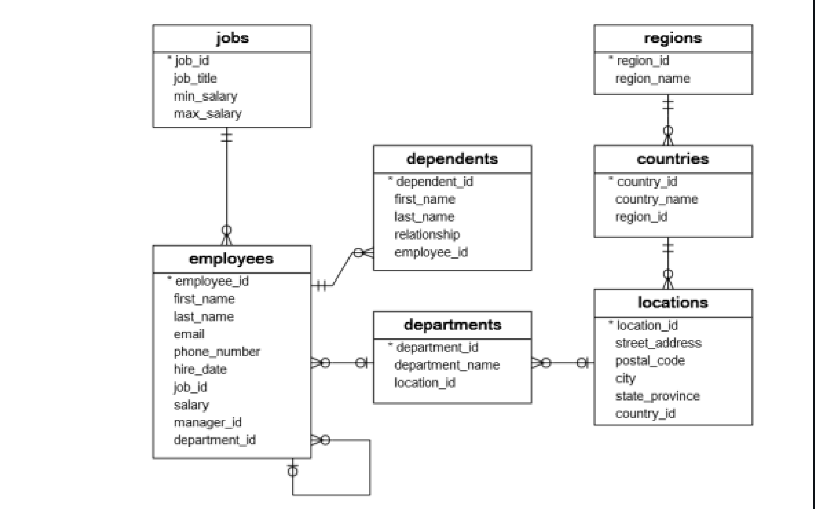
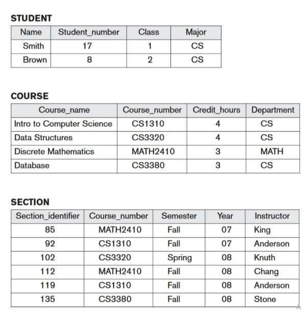
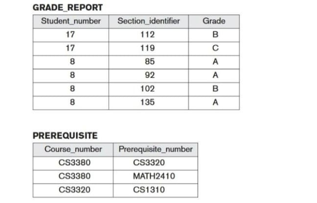

## Exercise 1 - ER to Table

The company database has seven tables:
1. The employees table stores the data of employees.
2. The jobs table stores the job data including job title and salary range.
3. The departments table stores department data.
4. The dependents table stores the employee’s dependents.
5. The locations table stores the location of the departments of the company. 
6. The countries table stores the data of countries where the company is doing business.
7. The regions table stores the data of regions such as Asia, Europe, America, and the Middle
East and Africa. The countries are grouped into regions.

I . WRITE QUERIES IN MYSQL TO DO THE FOLLOWING:
1. Design and create database which consists of above seven tables.
2. Rename Departments table to Dept.
3. Modify Column Salary from int to smallint
4. Add Commission column to the Employees table.

5. Enter the given queries to insert values in Employees table.

[Solution](./exercise1.sql)

## Exercise 2 - Queries

1. Write a query to display all the countries.
2. Write a query to display specific columns like email and phone number for all the
employees.
3. Write a query to display the data of employee whose last name is “Fay”.
4. Write a query to find the hire date for employees whose last name is “Grant” or “Whalen”.
5. Write a query to display name of the employee who is shipping clerk.
6. Write a query to get all the employees who work for department 8.
7. Write a query to display the departments in the descending order.
8. Write a query to display all the employees whose last name starts with “K”.
9. Display name of the employees whose hire dates are between 1995 and 1997.
10. Write a query to display jobs where the maximum salary is less than 5000.
11. Write a query to display email address in lower case.
12. Write a query to display name of the employees who were hired in 1995.
13. Write a query to insert an employee “Paul Newton” in department 11.
14. Write a query to delete the shipping department

[Solution](./exercise2.sql)

## Exercise 3 - Queries

A UNIVERSITY database for maintaining information concerning students, courses, and grades in a university environment is given below.
The STUDENT file stores data on each student, the COURSE file stores data on each course, the SECTION file stores data on each section of a course, the GRADE_REPORT file stores the grades that students receive in the various sections they have completed, and the PREREQUISITE file stores the prerequisites of each course.

1. Write appropriate MYSQL DDL statements to define the UNIVERSITY database.
2. Write queries to insert values in all the five tables.
3. Retrieve the list of all courses and grades of 'Smith'
4. List the names of students who took the section of the 'Database' course offered in fall 2008 and their grades in that section
5. List the prerequisites of the 'Database' course.
6. Retrieve the names of all senior students majoring in 'CS' using `VIEW`.
7. Retrieve the names of all courses taught by Professor King in 2007 and 2008.
8. For each section taught by Professor King, retrieve the course number, semester, year, and number of students who took the section.
9. Retrieve the name and transcript of each senior student (Class = 4)majoring in CS. A transcript includes course name, course number, credit hours, semester, year, and grade for each course completed by the student.
10. Write SQL update statements to do the following on the database schema.
A. Insert a new student, <'Johnson', 25, 1, 'Math'>, in the database.
B. Change the class of student 'Smith' to 2.
C. Insert a new course, <'Knowledge Engineering', 'CS4390', 3, 'CS'>.
D. Delete the record for the student whose name is 'Smith' and whose student number
is 17.

[Solution](./exercise3.sql)

## Exercise 4 - PLSQL

Create a PLSQL procedure to
    
    a. check whether a number is even or odd.
    b. display the description against a grade.
    c. check whether a given no is +ve,-ve or 0.
    d. display which day is a specific date.
    e. factorial of a number.

[Solution](./exercise4pl.sql)

## Exercise 5 - Procedure

Create a database "STORE" with table named Product (Pdtld, PName, Price, Quantity) and create a stored procedure called Insertproduct that inserts a new product into the database, under some conditions. 
The stored procedure has as input parameters the barcode, the product name, price, and quantityInStock. 
The stored procedure should insert a row in the Product table only if the price is greater than 0 and the quantity is greater or equal to 0.
If the conditions are not satisfied, the stored procedure just terminates (no errors generated)

[Solution](./exercise5.sql)

## Exercise 6 - Trigger

Create three tables named:
Product (Pdtld, Pname, Price, Qtyinstock), Sale(saleld, Deliveryaddess), and Saleitem(saleld, Pdtid, Qty).

Create a trigger called updateAvailable Quantity that updates the quantity in stock in the product table, for every product sold. 
The trigger should be executed after each insert operation on the Saleitem table: for the product with given Ptdld(the one inserted into Saleitem), update the available quantity in Product table to be the old quantity minus the sold quantity.

[Solution](./exercise6.sql)

## Exercise 7 - MongoDB

Create a database named college and then create a collection named studlist. Insert some values into it (You can use the data in [students.json](./students.json) file).
Write MongoDB queries to:
1. Display name (both fname and Iname) and mark of all female students in MCA department.
2. Display the details of student who secured highest mark in the course MCA
3. Display all male students who secured A+ grade.
4. Display the names of the top three students in Mechanical department.
5. Display the details of female students [fname, Iname, grade, mark, contact] who achieved a mark more than 90.
6. Display the details of students who secured mark, more than 80 but less than 90.
7. Display the details of students whose name starts with 'V'
8. Display all students from Kollam
9. Display all students who does not belong to neither Kollam nor Thiruvananthapuram
I
10. Display all female students who belong to either Kollam or Thiruvananthapuram

[Solution](./exercise7.ipynb)
