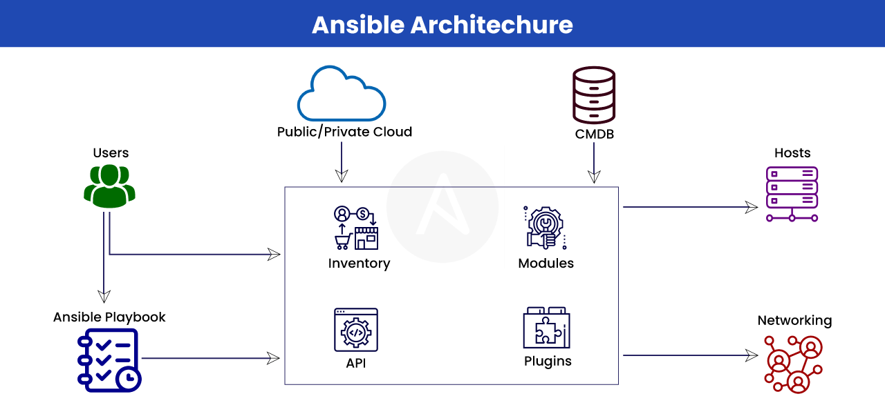

# Ansible

Ansible is an open-source software provisioning, configuration management and application deployment tool.
Ansible works by assigning one system as a control station, known as the Ansible **control node**.
This control node is responsible for managing and orchestrating the configuration and deployment of other systems, known as **managed nodes**.
Ansible uses a declarative language called YAML to define the desired state of the managed nodes, making it easy to automate complex configuration management tasks.



Ansible is owned by RedHat and it's python-based.
Ansible is **Agent-less**, meaning, it does not require installing a client on the systems.
The control node communicates with the managed nodes over SSH or WinRM protocols, allowing it to execute tasks and playbooks remotely. 


### Q. Write an Ansible playbook to deploy a new Linux VM on a remote server.

```yaml
---
- name: Deploy Linux VM
  hosts: remote_server
  become: yes
  vars:
    vm_name: myvm
    vm_disk_size: 20G
    vm_memory: 1024
    vm_vcpus: 2
    vm_os_variant: centos7
    vm_install_iso: /path/to/linux.iso
    vm_network_bridge: br0
    vm_network_mac: 00:11:22:33:44:55
    vm_network_ip: 192.168.1.100
    vm_network_netmask: 255.255.255.0
    vm_network_gateway: 192.168.1.1
    vm_network_dns: 8.8.8.8

  tasks:
    - name: Create VM Disk Image
      command: qemu-img create -f qcow2 /var/lib/libvirt/images/{{ vm_name }}.qcow2 {{ vm_disk_size }}
      register: disk_created

    - name: Install Linux VM
      command: >
        virt-install
        --name={{ vm_name }}
        --memory={{ vm_memory }}
        --vcpus={{ vm_vcpus }}
        --os-variant={{ vm_os_variant }}
        --disk path=/var/lib/libvirt/images/{{ vm_name }}.qcow2,format=qcow2
        --cdrom {{ vm_install_iso }}
        --network bridge={{ vm_network_bridge }},mac={{ vm_network_mac }},ip={{ vm_network_ip }},netmask={{ vm_network_netmask }},gateway={{ vm_network_gateway }},nameserver={{ vm_network_dns }}
        --noautoconsole
      register: vm_installed

    - name: Wait for VM Installation to Complete
      wait_for:
        path: /var/lib/libvirt/images/{{ vm_name }}.qcow2
        state: present
        timeout: 600
```
```sh
# To run the playbook
ansible-playbook -i inventory_file deploy_vm.yml
```
