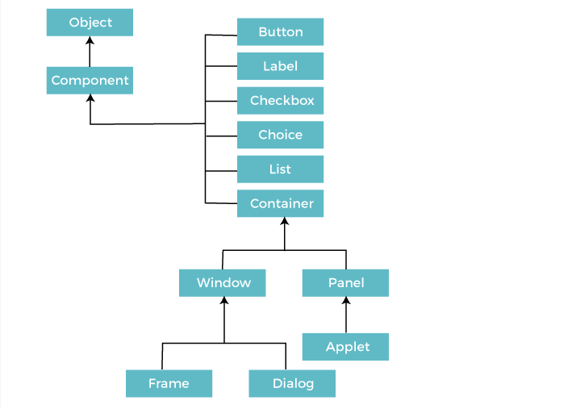

# Abstract Window Toolkit

AWT is a package in Java that provides classes for creating Graphical User Interface (GUI) components. AWT is a part of the Java Foundation Classes (JFC) that is used to build graphical user interfaces for Java applications. 

AWT is the foundation upon which **Swing** (Java's GUI toolkit) is built. AWT is also the GUI toolkit for a number of other Java ME profiles.

AWT components are **platform-dependent** i.e. components are rendered using native components of the platform in which it is running. AWT is **heavyweight** i.e. its components are rendered by the operating system's GUI toolkit. 

The AWT package has a number of classes such as `TextField`, `Label`, `Button`, `TextArea`, `Checkbox`, `Choice`, etc. These components are added to a container (like Frame, Panel, etc.) and displayed on the screen.

AWT is simple to use but not as flexible or lightweight as Swing. AWT is used for building simple GUIs while Swing is used for building complex GUIs.

The hierarchy of classes in AWT are:

| Component     | Description |
| ------------- | ----------- |
| `Components`    | All elements like button, text fields, scroll bars etc. |
| `Container`     | Elements that can contain other elements. Containers extend the `Container` class (eg. `Frame`, `Dialog`, `Panel` etc.). |
| `Window`        | A top-level container with no borders and menu bar. |
| `Panel`         | A generic container for holding other containers. |
| `Frame`         | A top-level window with a title and border (optionally, menu bars).|
| `Dialog`        | A top-level window with a title and border, used for taking user input.|
| `Button`        | A clickable button that can trigger an event.|
| `Label`         | A non-interactive text element. |
| `TextField`     | A single-line text input field. |
| `TextArea`      | A multi-line text input field. |
| `CheckBox`      | A box that can be checked or unchecked. |
| `RadioButton`   | A circular button that can be selected or deselected, usually used in groups where only one can be selected at a time. RadioButtons extend the `Checkbox` class but are used with a `CheckboxGroup`. |
| `Choice`        | A drop-down list of options. Extends the `Choice` class. |
| `List`          | A list of items that the user can select.|
| `Scrollbar`     | A bar that can be moved up and down or left and right to navigate through content. |
| `MenuBar`, `Menu`, and `MenuItem` | Components for creating a menu system.|

